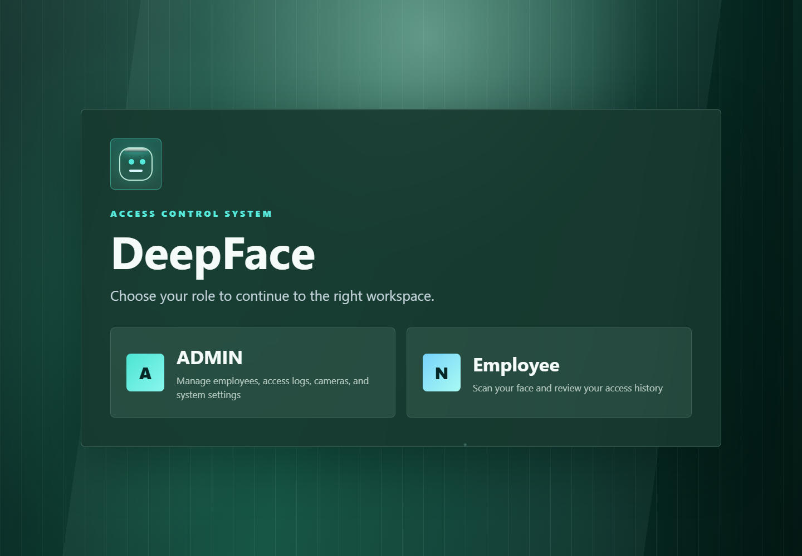
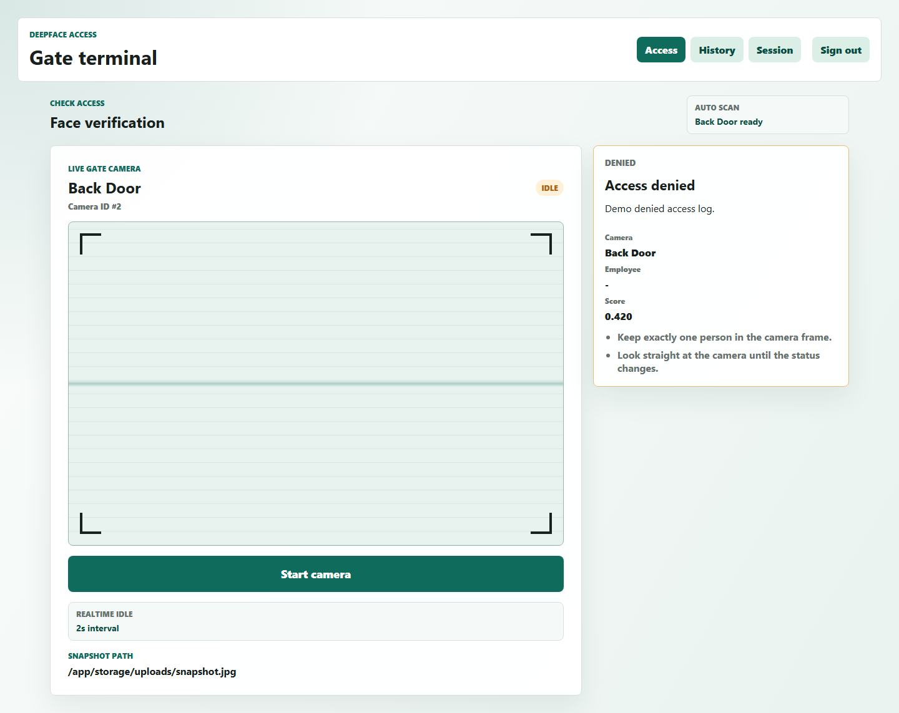
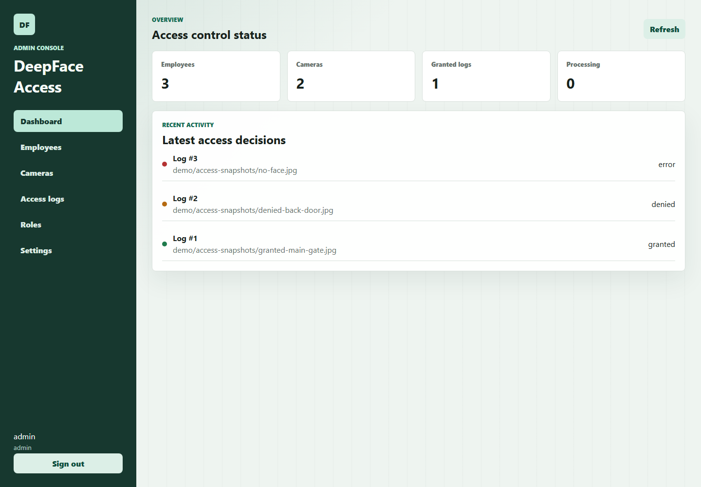

<p align="center">
  
</p>

<div align="center">

**Nền tảng kiểm soát ra vào bằng nhận diện khuôn mặt, xây dựng theo kiến trúc nhiều dịch vụ với giao diện quản trị, terminal người dùng, worker AI và lớp hạ tầng demo đầy đủ.**

<br>


<br><br>


<br><br>

<a href="#giao-diện">Giao diện</a>
<span> • </span>
<a href="#điểm-nổi-bật">Điểm nổi bật</a>
<span> • </span>
<a href="#kiến-trúc">Kiến trúc</a>
<span> • </span>
<a href="#chạy-nhanh">Chạy nhanh</a>
<span> • </span>
<a href="#kiểm-thử">Kiểm thử</a>
<span> • </span>
<a href="#ghi-chú-production">Production</a>

</div>

---

## Giao Diện

<p align="center">
  
</p>

<table>
  <tr>
    <td align="center" width="50%">
      <strong>User Access Terminal</strong>
      <br>
      <sub>Terminal người dùng để gửi ảnh, kiểm tra quyền ra vào và xem lịch sử.</sub>
    </td>
    <td align="center" width="50%">
      <strong>Admin Control Dashboard</strong>
      <br>
      <sub>Bảng điều khiển quản trị employee, camera, user và access logs.</sub>
    </td>
  </tr>
  <tr>
    <td></td>
    <td></td>
  </tr>
</table>

## Điểm Nổi Bật

<table>
  <tr>
    <td width="25%">
      <strong>Nhận diện khuôn mặt</strong>
      <br>
      <sub>DeepFace tạo embedding, worker xử lý job nền và cập nhật kết quả truy cập.</sub>
    </td>
    <td width="25%">
      <strong>Vector search</strong>
      <br>
      <sub>Qdrant tìm embedding gần nhất, PostgreSQL vẫn là source of truth.</sub>
    </td>
    <td width="25%">
      <strong>Upload ảnh qua MinIO</strong>
      <br>
      <sub>Ảnh enrollment và snapshot access được lưu bằng object key.</sub>
    </td>
    <td width="25%">
      <strong>Quan sát vận hành</strong>
      <br>
      <sub>Health check, Prometheus metrics, Grafana dashboard và Alertmanager baseline.</sub>
    </td>
  </tr>
</table>

## Kiến Trúc

```text
Frontend Home / User / Admin
          |
          v
      Nginx Gateway
          |
          v
      Backend API
          |
          +--> PostgreSQL        users, employees, cameras, logs, embeddings
          +--> MinIO             enrollment images and access snapshots
          +--> Redis             embedding_jobs and access_jobs
                    |
                    v
                AI Worker
                    |
                    +--> DeepFace detection / embedding / liveness
                    +--> Qdrant vector search
                    +--> PostgreSQL access log update
```

### Luồng Demo Chính

<table>
  <tr>
    <td align="center" width="140">
      
    </td>
    <td>
      <strong>Khởi tạo dữ liệu vận hành</strong>
      <br>
      Admin tạo employee và camera trong Admin Console.
    </td>
  </tr>
  <tr>
    <td align="center">
      
    </td>
    <td>
      <strong>Enrollment khuôn mặt</strong>
      <br>
      Admin upload ảnh khuôn mặt cho employee, backend lưu object vào MinIO.
    </td>
  </tr>
  <tr>
    <td align="center">
      
    </td>
    <td>
      <strong>Tạo embedding job</strong>
      <br>
      Backend đẩy job vào Redis queue <code>embedding_jobs</code> để worker xử lý nền.
    </td>
  </tr>
  <tr>
    <td align="center">
      
    </td>
    <td>
      <strong>Index vector nhận diện</strong>
      <br>
      Worker tạo embedding, lưu PostgreSQL và index vector vào Qdrant.
    </td>
  </tr>
  <tr>
    <td align="center">
      
    </td>
    <td>
      <strong>Check access tại cổng</strong>
      <br>
      User upload snapshot hoặc chụp frame webcam tại User Terminal.
    </td>
  </tr>
  <tr>
    <td align="center">
      
    </td>
    <td>
      <strong>Ra quyết định truy cập</strong>
      <br>
      Worker so khớp khuôn mặt và cập nhật access log thành
      <code>granted</code>, <code>denied</code>, <code>processing</code> hoặc <code>error</code>.
    </td>
  </tr>
</table>

## Chạy Nhanh

<p>
  
  
  
</p>

<table>
  <tr>
    <th width="33%">
      
    </th>
    <th width="33%">
      
    </th>
    <th width="33%">
      
    </th>
  </tr>
  <tr>
    <td>
      <pre><code>Copy-Item .env.example .env</code></pre>
    </td>
    <td>
      <pre><code>docker compose up --build -d</code></pre>
    </td>
    <td>
      <pre><code>docker compose ps
.\scripts\demo-baseline-check.ps1</code></pre>
    </td>
  </tr>
</table>

<details>
  <summary><strong>Dừng stack</strong></summary>

```powershell
docker compose down
```

</details>

## URL Mặc Định

| Thành phần | URL | Mục đích |
| --- | --- | --- |
| Home gateway | `http://localhost:8080` | Trang chọn vai trò |
| User UI | `http://localhost:8080/user/` | Terminal kiểm tra truy cập |
| Admin UI | `http://localhost:8080/admin/` | Bảng điều khiển quản trị |
| Backend health | `http://localhost:8000/health` | Health check API |
| Backend docs | `http://localhost:8000/docs` | Swagger UI |
| MinIO console | `http://localhost:9001` | Object storage |
| Prometheus | `http://localhost:9090` | Metrics |
| Alertmanager | `http://localhost:9093` | Alert routing |
| Grafana | `http://localhost:3000` | Dashboard |
| Qdrant HTTP | `http://localhost:6333` | Vector database |

Nếu máy đang có tiến trình khác chiếm port mặc định, đặt port override trong `.env` trước khi chạy:

```env
POSTGRES_PORT=15432
REDIS_PORT=16379
BACKEND_PORT=18001
FRONTEND_HOME_PORT=15172
FRONTEND_USER_PORT=15173
FRONTEND_ADMIN_PORT=15174
NGINX_PORT=18081
MINIO_API_PORT=19000
MINIO_CONSOLE_PORT=19001
QDRANT_HTTP_PORT=16333
QDRANT_GRPC_PORT=16334
PROMETHEUS_PORT=19090
ALERTMANAGER_PORT=19093
GRAFANA_PORT=13000
VITE_API_BASE_URL=http://localhost:18001
```

Khi đổi `VITE_API_BASE_URL`, cần rebuild lại frontend:

```powershell
docker compose up --build -d frontend-user frontend-admin nginx
```

Nếu đổi port frontend hoặc gateway, thêm origin tương ứng vào `BACKEND_CORS_ORIGINS`.

## Tài Khoản Demo

| Vai trò | Username | Password |
| --- | --- | --- |
| Admin | `admin` | `admin123` |
| User | `user` | `user123` |
| Grafana | `admin` | Giá trị `GRAFANA_ADMIN_PASSWORD` |
| MinIO | Giá trị `MINIO_ROOT_USER` | Giá trị `MINIO_ROOT_PASSWORD` |

Tài khoản demo được tạo bởi service `db-seed`. Có thể đổi bằng `SEED_ADMIN_USERNAME`, `SEED_ADMIN_PASSWORD`, `SEED_USER_USERNAME`, `SEED_USER_PASSWORD`.

## Services

| Service | Vai trò | Port mặc định | Override |
| --- | --- | --- | --- |
| `database` | PostgreSQL source of truth | `5432` | `POSTGRES_PORT` |
| `redis` | Job queue | `6379` | `REDIS_PORT` |
| `db-seed` | Tạo bảng và seed dữ liệu demo | none | none |
| `backend` | FastAPI server | `8000` | `BACKEND_PORT` |
| `worker` | AI job processor | none | none |
| `frontend-home` | Trang chọn vai trò | `5172` | `FRONTEND_HOME_PORT` |
| `frontend-user` | User terminal | `5173` | `FRONTEND_USER_PORT` |
| `frontend-admin` | Admin console | `5174` | `FRONTEND_ADMIN_PORT` |
| `nginx` | Gateway | `8080` | `NGINX_PORT` |
| `minio` | S3-compatible object storage | `9000`, `9001` | `MINIO_API_PORT`, `MINIO_CONSOLE_PORT` |
| `qdrant` | Vector database | `6333`, `6334` | `QDRANT_HTTP_PORT`, `QDRANT_GRPC_PORT` |
| `prometheus` | Metrics scrape | `9090` | `PROMETHEUS_PORT` |
| `alertmanager` | Local alert routing | `9093` | `ALERTMANAGER_PORT` |
| `grafana` | Metrics dashboard | `3000` | `GRAFANA_PORT` |

## Cấu Trúc Repo

```text
.
|-- backend/                 FastAPI API, models, schemas, repositories, tests
|-- worker/                  DeepFace pipeline, job handlers, vector search, tests
|-- frontend/
|   |-- home/                Static home page
|   |-- user/                React user terminal
|   `-- admin/               React admin console
|-- nginx/                   Gateway config
|-- monitoring/              Prometheus, Alertmanager, Grafana provisioning
|-- helm/deepface-access/    Kubernetes chart baseline
|-- docs/                    Architecture, API, deployment and operations notes
|-- docs/screenshots/        README preview screenshots
|-- scripts/                 Test, seed, smoke, backup and readiness scripts
|-- data/smoke/              Small smoke-test image set
`-- docker-compose.yml       Local multi-service runtime
```

## Kiểm Thử

Chạy bộ kiểm thử tổng hợp:

```powershell
.\scripts\test.ps1
```

| Phạm vi | Lệnh |
| --- | --- |
| Backend API tests | `python -m pytest backend\app\tests` |
| Worker tests | `python -m pytest worker\app\tests` |
| Admin frontend build | `npm run build` |
| User frontend build | `npm run build` |

Kiểm tra baseline khi stack đang chạy:

```powershell
.\scripts\demo-baseline-check.ps1
```

Kiểm tra file và cấu hình, không gọi runtime:

```powershell
.\scripts\demo-baseline-check.ps1 -StaticOnly
```

Smoke test DeepFace thật:

```powershell
.\scripts\smoke-deepface.ps1
```

Smoke test dùng PostgreSQL, Qdrant và worker container để tạo embedding thật và kiểm tra matching. Lần đầu có thể chậm vì model weights được cache vào Docker volume `deepface_weights`.

## API Surface

| Nhóm | Endpoint tiêu biểu | Mục đích |
| --- | --- | --- |
| Auth | `POST /auth/login`, `GET /auth/me` | Đăng nhập và lấy user hiện tại |
| Admin users | `GET/POST/PUT/DELETE /admin/users` | Quản lý tài khoản |
| Employees | `GET/POST/PUT/DELETE /employees` | Quản lý nhân viên |
| Employee images | `POST /employees/{id}/face-image` | Upload ảnh enrollment và queue embedding job |
| Cameras | `GET/POST/PUT/DELETE /cameras` | Quản lý camera |
| Access | `POST /access/check`, `POST /access/check-image` | Queue access check |
| Logs | `GET /logs` | Lịch sử ra vào |
| Operations | `GET /health`, `GET /metrics`, `GET /admin/status` | Trạng thái runtime và metrics |

Chi tiết hơn nằm trong `docs/api.md`.

## Cấu Hình Chính

| Biến | Ý nghĩa |
| --- | --- |
| `DATABASE_URL` | PostgreSQL connection string cho backend và worker |
| `REDIS_URL` | Redis queue URL |
| `AUTH_SECRET_KEY` | JWT signing secret |
| `BACKEND_CORS_ORIGINS` | Danh sách frontend origins được phép gọi API |
| `VITE_API_BASE_URL` | Backend URL được build vào frontend assets |
| `MINIO_ENDPOINT` | MinIO endpoint nội bộ trong Docker network |
| `MINIO_BUCKET` | Bucket lưu ảnh |
| `QDRANT_URL` | Qdrant URL nội bộ |
| `QDRANT_COLLECTION` | Collection lưu vector embedding |
| `DEEPFACE_MODEL_NAME` | Model embedding, mặc định `Facenet512` |
| `DEEPFACE_MATCH_THRESHOLD` | Threshold matching |
| `DEEPFACE_ANTI_SPOOFING` | Bật hoặc tắt anti-spoofing |
| `MAX_PROCESSING_ACCESS_LOGS_PER_CAMERA` | Giới hạn queue pressure theo từng camera |

## Ghi Chú Production

Các giá trị mặc định chỉ dành cho demo local. Trước khi deploy thật:

- Đổi `AUTH_SECRET_KEY`, PostgreSQL password, MinIO credentials, Grafana password và seed passwords.
- Không dùng `admin123`, `user123`, `minioadmin` ngoài demo.
- Giới hạn `BACKEND_CORS_ORIGINS` đúng domain frontend thật.
- Dùng image tag bất biến như commit SHA thay vì `latest`.
- Đặt HTTPS/TLS ở public ingress hoặc reverse proxy.
- Bổ sung giới hạn kích thước upload và validate nội dung ảnh thật, không chỉ dựa vào extension.
- Rà lại quyền `GET /logs`; demo/operator dùng được, nhưng quá rộng nếu `user` là nhân viên cá nhân.
- Chuyển migration sang Alembic khi schema ổn định.

## CI/CD Và Deployment

GitHub Actions hiện có:

- Chạy backend tests trên Python 3.12.
- Chạy worker tests trên Python 3.12.
- Build user/admin frontend trên Node 22.
- Build Docker images cho backend, worker, frontend-home, frontend-user và frontend-admin.
- Publish Docker Hub images trên `main` khi có secrets `DOCKERHUB_USERNAME` và `DOCKERHUB_TOKEN`.

Helm chart baseline nằm trong `helm/deepface-access`. Khi deploy lên cluster thật, cần tạo Kubernetes Secrets cho database/auth/minio và cấu hình image registry/tag rõ ràng.

## Backup

```powershell
.\scripts\backup.ps1
```

Backup output được ghi vào `backup/`. File backup sinh ra được ignore bởi Git, còn `.gitkeep` giữ cấu trúc thư mục.

## Troubleshooting

| Vấn đề | Cách kiểm tra |
| --- | --- |
| `Bind for 0.0.0.0:<port> failed` | Port đang bị app/container khác chiếm. Đặt biến port override trong `.env`. |
| Không kết nối được Docker API | Mở Docker Desktop và đợi daemon sẵn sàng. |
| Worker DeepFace khởi động chậm | Lần đầu cần tải/khởi tạo model weights. Các lần sau dùng lại volume `deepface_weights`. |
| Frontend gọi sai backend URL | Kiểm tra `VITE_API_BASE_URL`, sau đó rebuild frontend images. |
| Browser báo lỗi CORS | Thêm origin frontend/gateway hiện tại vào `BACKEND_CORS_ORIGINS`. |

## Roadmap

- Tách `image_key` / `object_key` thành field riêng thay vì lưu trong `image_path`.
- Thêm Alembic migrations.
- Thêm max upload size, MIME sniffing và image dimension validation.
- Thêm Playwright E2E tests cho login, employee enrollment và access check.
- Lưu nhiều embedding cho mỗi employee để ổn định hơn khi đổi ánh sáng/góc mặt.
- Thêm báo cáo accuracy nhỏ: đúng, sai, reject và latency trung bình.
- Thêm số liệu realtime: latency trung bình, worst-case latency, success rate và queue pressure.
- Siết role/permission cho access logs nếu tách rõ user cá nhân và operator.

<p align="center">
  
</p>
